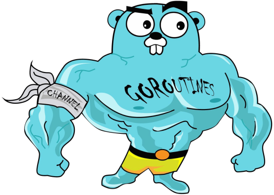

# GoTestRestApi

## This is test rest api application. It can create/update/delete user, get one user and get all users.

### For create table
`migrate -path ./db/migration -database 'postgres://postgres@localhost:5432/postgres?sslmode=disable' up`
### For drop db 
`migrate -path ./db/migration -database 'postgres://postgres@localhost:5432/postgres?sslmode=disable' drop`
### For start app
`go run cmd/main.go`

### Routes

GET    /users  

POST   /users   

POST   /users/admin

GET    /users/:id  

PUT    /users/:id 

DELETE /users/:id

### Current fields of user
ID        uuid

Firstname string    

Lastname  string   

Email     string    

Age       int 

Role_id   int

Created   timestamp

### Current fields of roles
ID   serial

Name string

### Used packages:
1) sqlx for sqlx request.
   
   Sqlx is a library which provides a set of extensions on go's standard database/sql library. This makes it relatively painless to integrate existing codebases using database/sql with sqlx.
2) gin for rest api.
   
   Gin is a web framework written in Go. It features a martini-like API with performance that is up to 40 times faster thanks to httprouter. If you need performance and good productivity, you will love Gin. This is one of the most often used frameworks on Go.
3) viper for read yaml config.
   
   It helps to you read config more easily

4) golang-migrate/migrate

   For create migrations

### Structure of project:

**/cmd** Main applications for this project.

**/handler** Applications for routes

**/repository** Applications for changes in database

**/service** Connect routes with repositories 

### Configs:
For input password from db you needed to create **.env** file with **DB_PASSWORD=** 

Other configs for db are in config.yml.

You can change port of server in config.yml too

